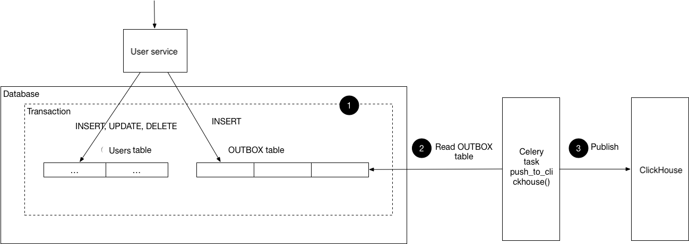

# Пояснения

<!-- TOC -->
* [Пояснения](#пояснения)
  * [Выбор паттерна и хранилища Outbox](#выбор-паттерна-и-хранилища-outbox)
  * [Ограничения и возможные улучшения](#ограничения-и-возможные-улучшения-)
  * [CI/CD](#cicd)
<!-- TOC -->

## Выбор паттерна и хранилища Outbox

Выбор паттерна - согласно заданию был выбран паттерн Outbox.
О выборе хранилища Outbox для событий перед вставкой в ClickHouse:

Первоначально кажется разумным заменить синхронный запрос на асинхронный, где мы будем пытаться повторно отправить запрос, пока он не выполнится успешно. Эта задача может быть делегирована брокеру сообщений. Однако, сталкиваемся с той же проблемой, что и при синхронных запросах: во время продюсинга сообщений в брокере может произойти сбой, и сообщение будет потеряно. Нам же нужно обеспечить гарантированную доставку.

Теперь публикация события осуществляется через вызов publish_event(), который записывает событие в таблицу Outbox в рамках той же транзакции, что и основная бизнес-логика. Задача Celery периодически обрабатывает записи из Outbox, отправляет их в ClickHouse пакетами и помечает как обработанные внутри атомарного блока.

Такой подход решает проблему потери событий, минимизирует влияние сетевых ошибок на UX и снижает нагрузку на ClickHouse за счёт пакетной отправки данных.

## Ограничения и возможные улучшения 

1. Значение `metadata_version` - не учитывал (в БД default=1) (могу добавить, однако, не нашел, какое значение присвоить)
2. Можно было бы реализовать механизм блокировки Outbox записей для предотвращения создания дублей в ClickHouse.
3. Сделать приоритетной выполнение бизнес логики над регистрацией события. 

По пункту 3:
Согласно документации паттерна, вставка в Outbox производится в той же транзакции, что ведет к откату разультатов бизнес логики, если создание записи не удалось:

1. Вся логика выполняется в пределах транзакции. Если все проходит без ошибок, транзакция будет зафиксирована.
2. Если возникает ошибка (например, при записи в Outbox), вся транзакция откатывается, и все изменения, сделанные до этого момента, отменяются. Таким образом, даже если пользователь был создан, но не был записан в Outbox, создание пользователя не сохранится.

## CI/CD

Настроен согласно заданию через GitHub Actions: [ci.yml](../.github/workflows/ci.yml)
